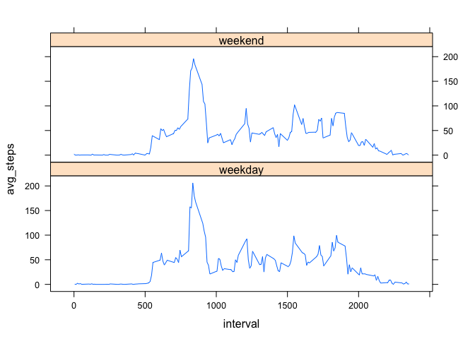

# Reproducible Research: Peer Assessment 1

---

## Loading and preprocessing the data
Load the data


```r
library(dplyr)

activity <- read.csv(unz("activity.zip","activity.csv"))
```


---

## What is mean total number of steps taken per day?
Make a histogram of the total number of steps taken each day


```r
total_steps_by_day <- activity %>% group_by(date) %>% summarise(total_steps=sum(steps))

hist(total_steps_by_day$total_steps, xlab="Total Number of Steps", ylab="Frequency", main="Total Number of Steps Taken Each Day")
```

 

Calculate and report the mean and median total number of steps taken per day


```r
steps_mean <- mean(total_steps_by_day$total_steps, na.rm=TRUE)
steps_median <- median(total_steps_by_day$total_steps, na.rm=TRUE)
```

**Mean: 10766.19, Median: 10765**


---

## What is the average daily activity pattern?
Make a time series plot (i.e. type = "l") of the 5-minute interval (x-axis) and the average number of steps taken, averaged across all days (y-axis)


```r
avg_steps_by_interval <- activity %>% group_by(interval) %>% summarise(avg_steps=mean(steps, na.rm=TRUE))

plot(avg_steps_by_interval, type="l", xlab="5-Minute Interval", ylab="Average Number of Steps Taken", main="Steps Taken by 5-Minute Interval (averaged across all days)")
```

 

Which 5-minute interval, on average across all the days in the dataset, contains the maximum number of steps?


```r
max_interval <- avg_steps_by_interval[order(avg_steps_by_interval$avg_steps,decreasing=TRUE),][1,1]
```

**5-minute interval with highest number of steps: 835**


---

## Imputing missing values
Calculate and report the total number of missing values in the dataset (i.e. the total number of rows with NAs)


```r
na_total <- sum(is.na(activity$steps))
```

**Total number of rows with NAs: 2304**

**This is due to the fact that there are 8 dates (2012-10-01, 2012-10-08, 2012-11-01, 2012-11-04, 2012-11-09, 2012-11-10, 2012-11-14, 2012-11-30) with no data. With 288 intervals per day, 8x288 = 2304**


Devise a strategy for filling in all of the missing values in the dataset. The strategy does not need to be sophisticated. For example, you could use the mean/median for that day, or the mean for that 5-minute interval, etc.


```r
avg_steps_by_interval <- activity %>% group_by(interval) %>% summarise(avg_steps=mean(steps, na.rm=TRUE))
```

**Decided to fill in NAs using the mean number of steps from each 5-minute interval since 8 days have no data whatsoever to impute a mean/median for that day.**


Create a new dataset that is equal to the original dataset but with the missing data filled in.


```r
activity_imputed <- activity
activity_imputed$steps <- ifelse(is.na(activity$steps), avg_steps_by_interval$avg_steps[match(activity$interval, avg_steps_by_interval$interval)], activity$steps)
```


Make a histogram of the total number of steps taken each day and Calculate and report the mean and median total number of steps taken per day. Do these values differ from the estimates from the first part of the assignment? What is the impact of imputing missing data on the estimates of the total daily number of steps?


```r
total_steps_by_day_imputed <- activity_imputed %>% group_by(date) %>% summarise(total_steps=sum(steps))
hist(total_steps_by_day_imputed$total_steps, xlab="Total Number of Steps", ylab="Frequency", main="Total Number of Steps Taken Each Day (Imputed NAs)")
```

 

```r
imputed_mean <- mean(total_steps_by_day_imputed$total_steps)
imputed_median <- median(total_steps_by_day_imputed$total_steps)
```

**Mean: 10766.19, Median: 10766.19**

**The mean does not change (which makes sense since the resulting total number of daily steps imputed into the 8 days worth of missing data would be the same). However, the median increases from 10765 to 10766.19 because the total number of daily steps from the 8 missing days is no longer 0. These days instead fall right into the middle of the distribution which is why the median and mean are now the same.**


---

## Are there differences in activity patterns between weekdays and weekends?
Create a new factor variable in the dataset with two levels – “weekday” and “weekend” indicating whether a given date is a weekday or weekend day.


```r
activity_imputed$day <- weekdays(as.Date(activity_imputed$date))
activity_imputed$day[activity_imputed$day=="Monday"] <- "weekday"
activity_imputed$day[activity_imputed$day=="Tuesday"] <- "weekday"
activity_imputed$day[activity_imputed$day=="Wednesday"] <- "weekday"
activity_imputed$day[activity_imputed$day=="Thursday"] <- "weekday"
activity_imputed$day[activity_imputed$day=="Friday"] <- "weekday"
activity_imputed$day[activity_imputed$day=="Saturday"] <- "weekend"
activity_imputed$day[activity_imputed$day=="Sunday"] <- "weekend"

avg_steps_by_interval_imputed <- activity_imputed %>% group_by(interval) %>% summarise(avg_steps=mean(steps, na.rm=TRUE))

avg_steps_by_interval_weekday <- activity_imputed %>% filter(day=="weekday") %>% group_by(interval) %>% summarise(mean(steps, na.rm=TRUE))
avg_steps_by_interval_weekend <- activity_imputed %>% filter(day=="weekend") %>% group_by(interval) %>% summarise(mean(steps, na.rm=TRUE))
```


Make a panel plot containing a time series plot (i.e. type = "l") of the 5-minute interval (x-axis) and the average number of steps taken, averaged across all weekday days or weekend days (y-axis).

```r
library(lattice)

xyplot(avg_steps ~ interval | c("weekend", "weekday"),
       data = avg_steps_by_interval_imputed,
       type = "l",
       layout = c(1, 2))
```

 
